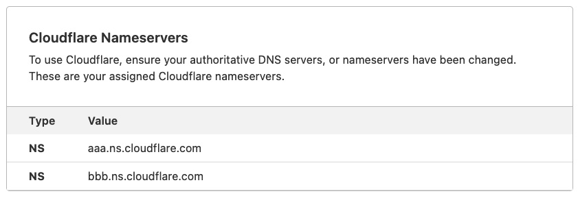
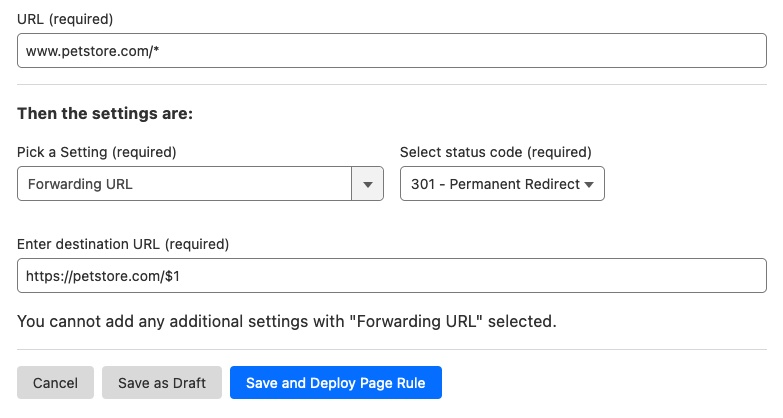
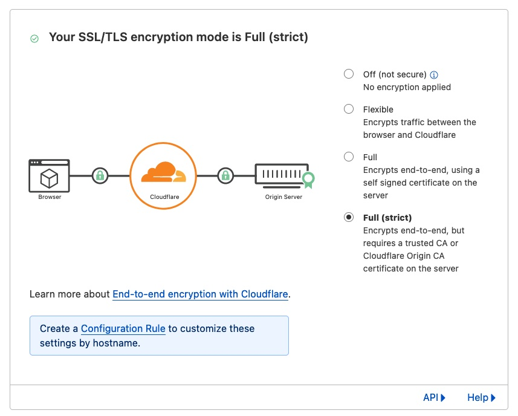
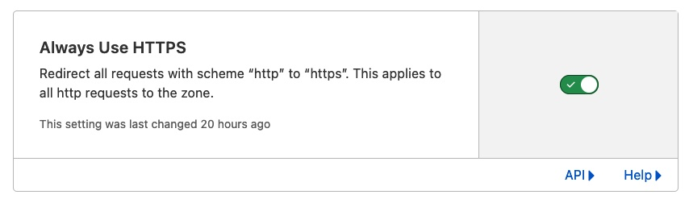
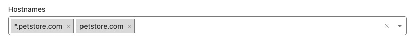
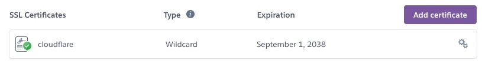

## Intro
Apps hosted on Heroku does not have static IP addresses assigned to them so it is impossible to simply setup `A` type DNS record (it requires IP). Most DNS registrars does not allow setting `CNAME` (also called `ALIAS`) to `root domain` (also called `naked domain`). Cloudflare allows such setting using, as they call it, `CNAME flattening`. Another features of Cloudflare are protection against various attacks and caching.

To combine above knowledge we can setup Cloudflare and point our preferred DNS registrar to Cloudflare nameservers. This way we will have naked domain, with added benefits of Cloudflare's features.

At the end of this guide our page will be hosted under `https://petstore.com`, all below addresses will lead to it:
* http://petstore.com
* https://www.petstore.com
* http://www.petstore.com

Connection will be secured with SSL.

## Perquisites
1. Deployed app on Heroku (most likely reachable with petstore.herokuapp.com)
2. Access to petstore.com DNS
3. Access to cloudflare.com account (free account will do)

## Step 1 - Add domain on Heroku
1. Go to Heroku dashboard > petstore app > Settings
1. Find `Domains` panel and click `Add domain`
1. Enter `petstore.com` as `Domain name`
1. Notice `DNS Target`, we will need it in next steps, keep tab open we will get back here soon.

## Step 2 - Add page in cloudflare
1. Go to cloudflare.com
1. Click on `Add a site`
1. Enter `petstore.com`
1. Add `CNAME` record `name = @`, `target = DNS Target (from Heroku)`, `proxy` turned on
1. Add `CNAME` record `name = www`, `target = petstore.com`, `proxy` turned on

1. Notice `Cloudflare Nameservers` below, we will need them later

## Step 3 - Add redirect from www to naked domain
1. Go to `Rules` panel
1. Click on `Create Page Rule`
1. For URL use `www.petstore.com/*`
1. Setting `Forwarding URL` with `status code = 301`
1. Destination `https://petstore.com/$1`

1. Click `Save and deploy`

This way `www.petstore.com/cats` forwards to `https://petstore.com/cats` instead of `https://petstore.com/`

## Step 4 - Setup SSL certificate
1. Go to `SSL/TLS` panel
1. In `Overview` tab pick encryption mode `Full (strict)`

1. In `Edge Certificates` tab turn on `Always Use HTTPS`

1. In `Origin Server` tab click `Create Certificate`, in hostnames list put two entries: `petstore.com` and `*.petstore.com`

1. Notice keys displayed there, keep the tab open
1. Go back to Heroku tab
1. Click on `Add certificate`
1. Set display, for example `cloudflare`
1. From cloudflare tab copy `public certificate` and `private certificate` to respective fields
1. Save certificate
1. If there were any certificates generated by heroku, remove them

1. Under `Domains` edit `petstore.com` and select cloudflare certificate

## Step 5 - Change nameservers with DNS registrar
Instructions will differ between all DNS registrars. For this example we will use GoDaddy.com.

1. Go to `godaddy.com`
1. Open `petstore.com` settings
1. In `DNS` tab open `name servers`
1. Use nameservers from step 1

## HARDEST PART
Wait until changes take place, it can take up to 48 hours (usually it's about an hour)

---

#### Sources 
1. https://medium.com/@conwayling/cloudflare-heroku-setup-redirect-naked-to-subdomain-aa56450e422c
1. https://gist.github.com/mrispoli24/043684c7af2c5b5ac3b71cd46ac60972